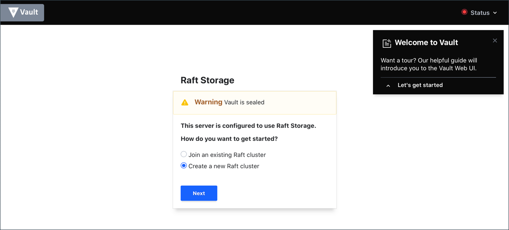

Enter 5 in the Key shares and 3 in the Key threshold text fields.

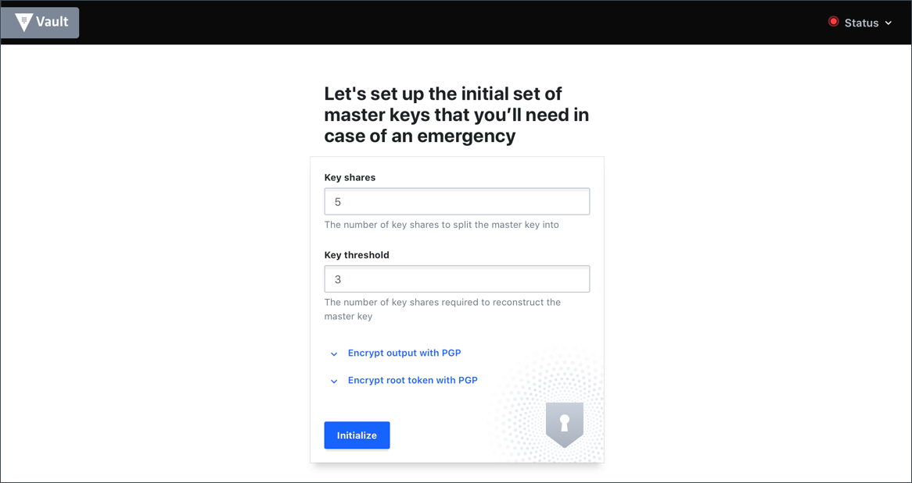

Click Initialize.

When the unseal keys are presented, scroll down to the bottom and select Download key. Save the generated unseal keys file to your computer.

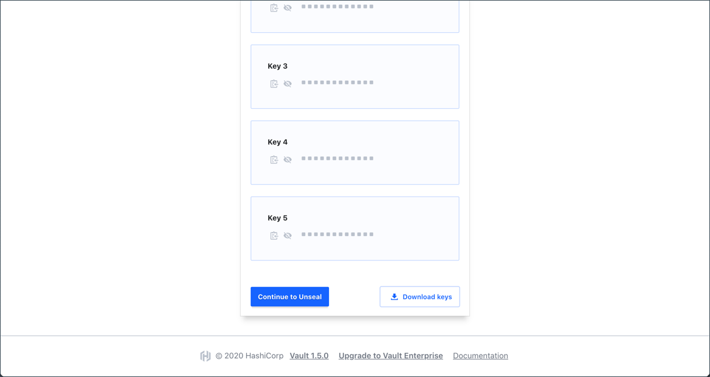

The unseal process requires these keys and the access requires the root token.

Click Continue to Unseal to proceed.

Open the downloaded file.

Example key file:

    {
     "keys": [
       "ecfb4ef59f9a2570f856c471cd3b0580e2b7d99962d5c9af7a25b80138affe935a",
      "807e9bbfb984c631becc526c621c9852f82d88b2347f7398ef7af3c1fbfbbe9fd0",
      "561a7ff6b44b88f96a2d9faca1ae514d1557008ce19283dcfe2fb746ed4f0f7d94",
      "3671e9e817177d79d3c004e0745e5f1d1a5cbfcd9fd6ad22505d4bc538176fa3f9",
      "313fffc1c848276fffe1e3fcfce4d3472d104cda466227ca155e4f693cfbaa36b9"
     ],
     "keys_base64": [
      "7PtO9Z+aJXD4VsRxzTsFgOK32Zli1cmveiW4ATiv/pNa",
      "gH6bv7mExjG+zFJsYhyYUvgtiLI0f3OY73rzwfv7vp/Q",
      "Vhp/9rRLiPlqLZ+soa5RTRVXAIzhkoPc/i+3Ru1PD32U",
      "NnHp6BcXfXnTwATgdF5fHRpcv82f1q0iUF1LxTgXb6P5",
     "MT//wchIJ2//4eP8/OTTRy0QTNpGYifKFV5PaTz7qja5"
     ],
      "root_token": "s.p3L38qZwmnHUgIHR1MBmACfd"
    }

Copy one of the keys (not keys_base64) and enter it in the Master Key Portion field. Click Unseal to proceed.

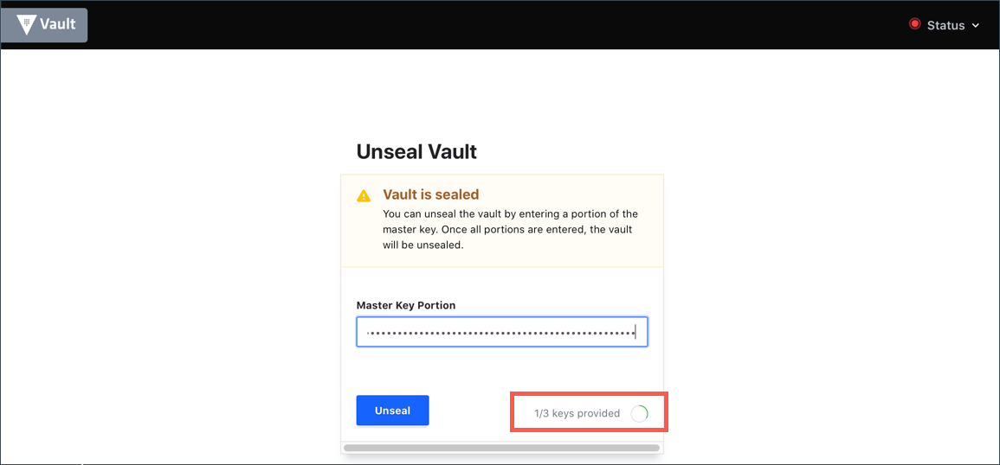

The Unseal status shows 1/3 keys provided.

Enter another key and click Unseal.

The Unseal status shows 2/3 keys provided.

Enter another key and click Unseal.

After 3 out of 5 unseal keys are entered, Vault is unsealed and is ready to operate.

Copy the root_token and enter its value in the Token field. Click Sign in.

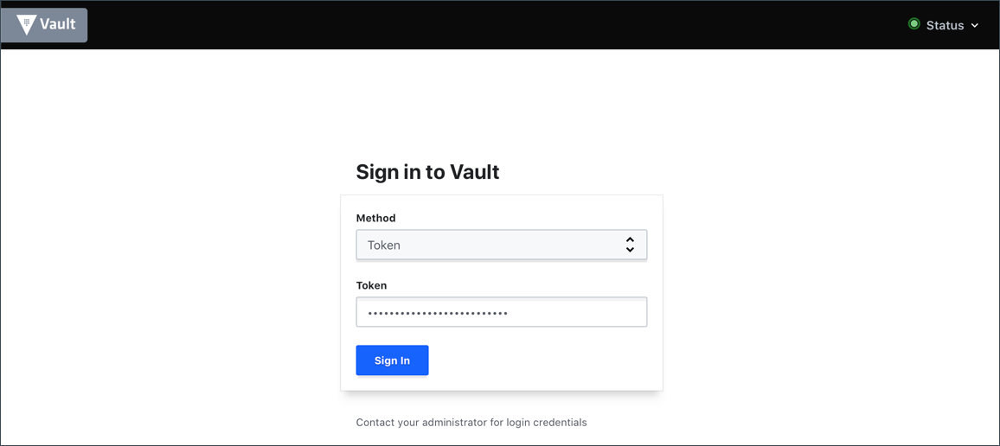

# Web UI Wizard
Vault UI has a built-in tutorial to navigate you through the common steps to operate various Vault features.

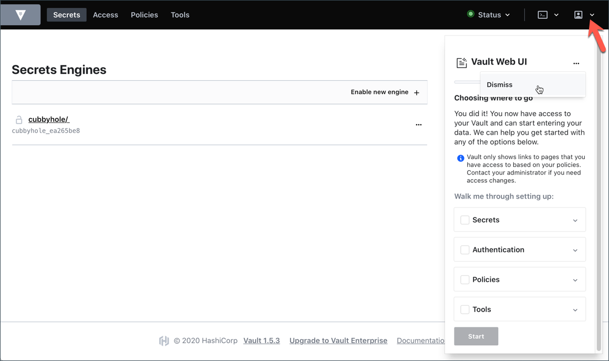

For now, click Dismiss to close it out. You can restart the guide later.

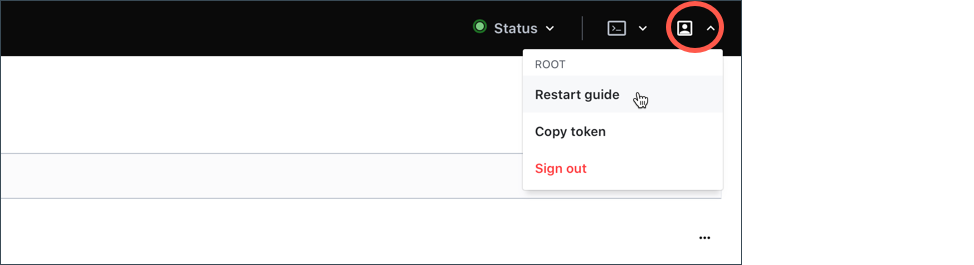

### Create Vault Policies

Policies provide a declarative way to grant or forbid access to certain paths and operations in Vault. In this step, you will create a policy and then edit it to support new requirements.

NOTE: This step assumes you started the Vault server and signed in with the root token in the Web UI step.

## Create a Policy
Select the Policies view from the menu

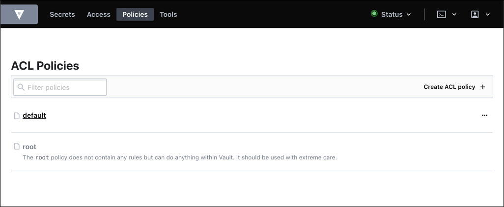

This view is the policy index and displays all the policies. The default policy and the root policy were created when Vault was initialized.

Select the Create ACL policy action.

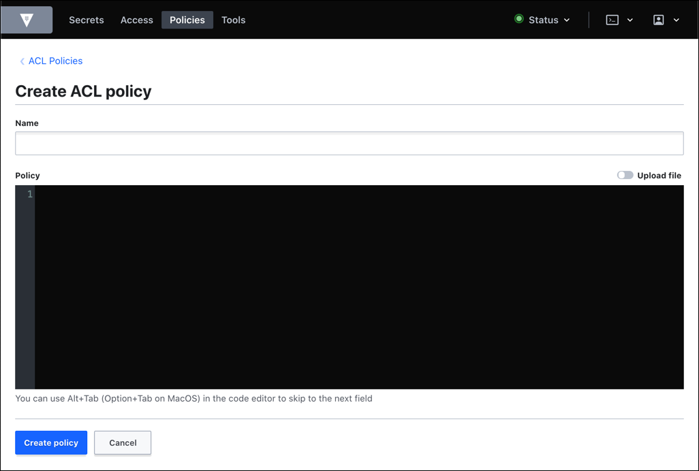

This view is the create policy view. Policies require a name. The contents of the policy can be entered through the editor or through a file.

Enter webapp in the Name field.

Enter this policy in the Policy field.

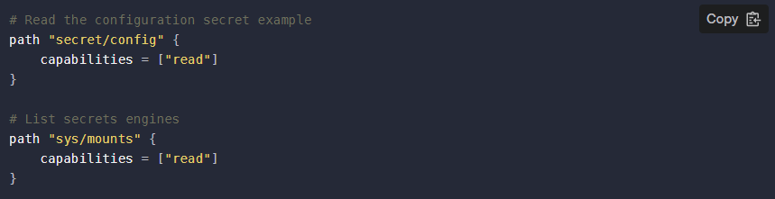

Choose the Create policy action at the bottom of the view.

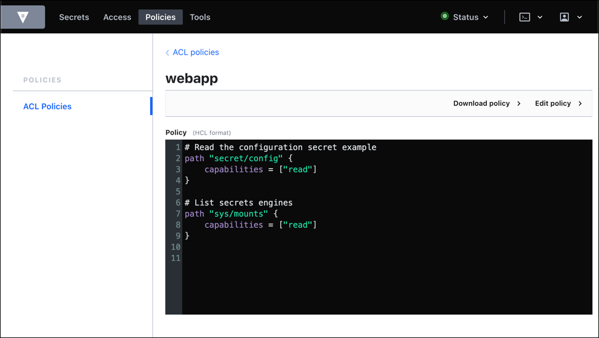

The policy is created and this view displays its name and contents.

Select the ACL Policies navigation from within the view.

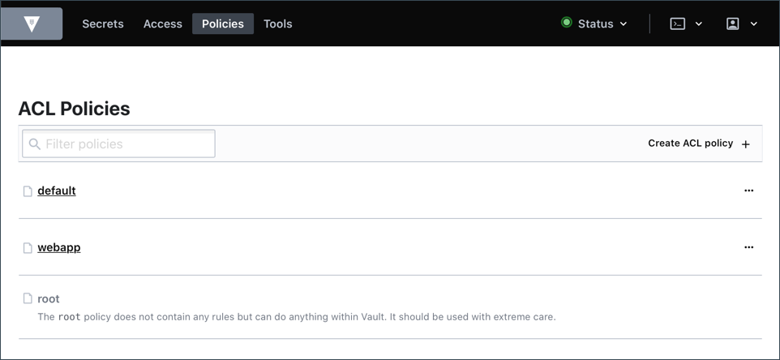
The view returns to the policy index. The new webapp policy is displayed.

Filtering: When there are a lot of policies, the Filter policies field can narrow the displayed policies down to a manageable list or the exact policy.

# Edit a policy
The webapp policy needs to be updated to support a new secrets engine and its paths required and capabilities.

Select the webapp policy title from within the policy index view.

This view displays the policy with its definition. The read-only policy field displays the entire contents of the policy.

Select the Edit policy action from within the view.

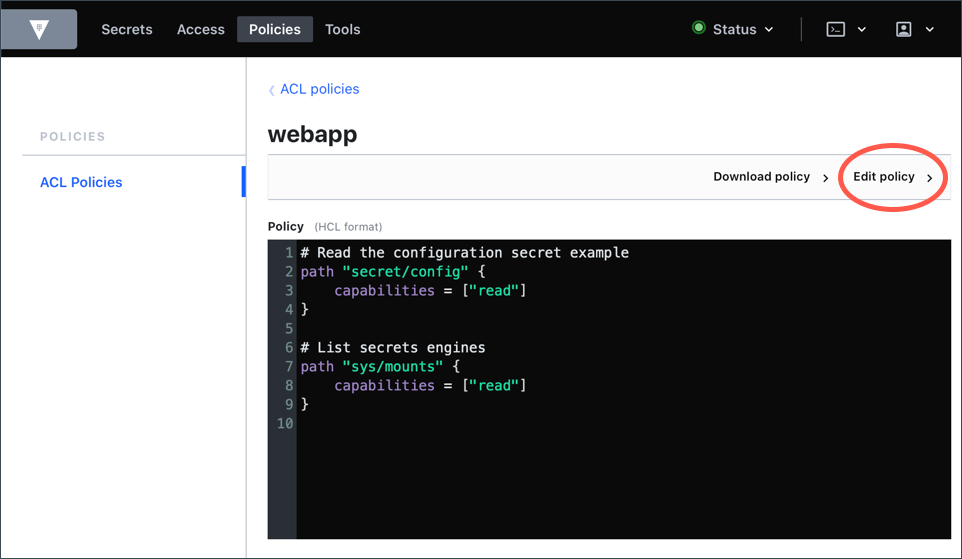

This view is the policy edit view. The Policy field provides a text editor preloaded with the policy definition.

Select the Policy text editor from within the view.

The editor enables navigation through the arrow keys.

Add this policy to after the other content in the Policy field.

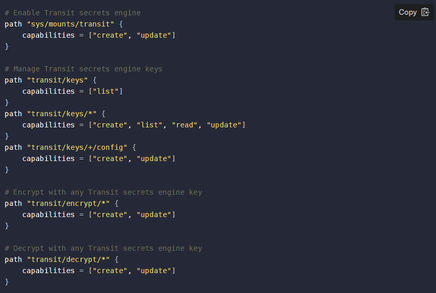

    Editing Tip: The editor supports common keyboard shortcuts for undo and redo. You can also reset every change back its original by choosing Cancel.

The updated policy needs to be saved.

Choose the Save action at the bottom of the view.

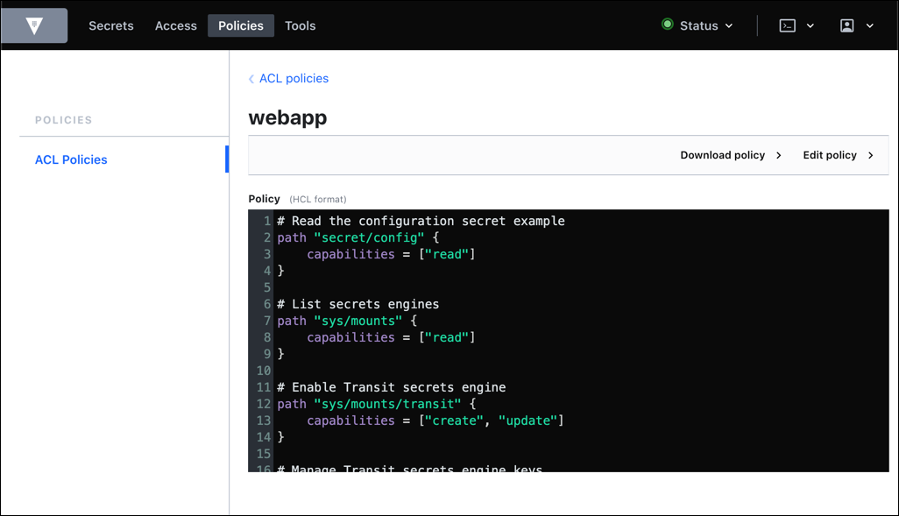

The policy is updated. The view returns to the policy and its updated definition.

